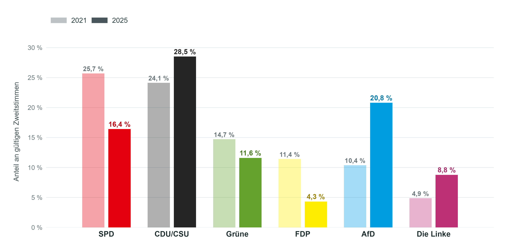
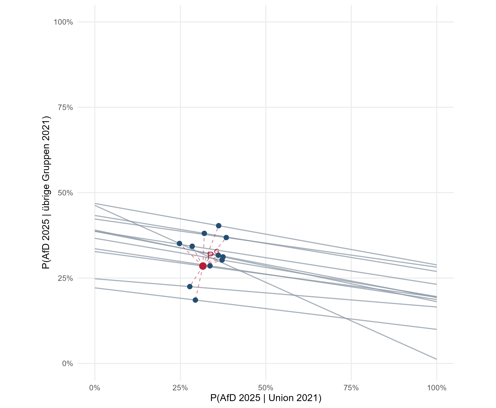

## Zweitstimmenanteile der Bundestagswahlen 2021 und 2025 {.custom-smaller}

```{r, echo=FALSE, out.width="100%"}

```

## Agenda {.custom-smaller}

1.  Ökologische Inferenz und \texttt{nslphom}

2.  Datengrundlage und -aufbereitung

3.  Ost-Fokussierung und \texttt{nslphom}-Ergebnisse

4.  Regressionsmodell und Bootstrap

5.  Ergebnisse

6.  Disskusion

7.  Fazit

## Ökologische Inferenz: Das Grundproblem {.custom-smaller}

::::: columns
::: {.column width="52%"}

Für jede räumliche Einheit $i$:

$$
\begin{array}{c|ccc|c}
 & k=1 & \cdots & k=K & \text{2021} \\ \hline
j=1 & N_{i11} & \cdots & N_{i1K} & x_{i1} \\
\vdots & \vdots & & \vdots & \vdots \\
j=J & N_{iJ1} & \cdots & N_{iJK} & x_{iJ} \\ \hline
\text{2025} & y_{i1} & \cdots & y_{iK} & n_i
\end{array}
$$

:::

::: {.column width="48%"}

**Beobachtet**

- Wahlergebnisse 2021: $x_{ij}$
- Wahlergebnisse 2025: $y_{ik}$

**Unbekannt**

- Übergänge $N_{ijk}$ zwischen beiden Wahlen

$$
\sum_k N_{ijk}=x_{ij},
\qquad
\sum_j N_{ijk}=y_{ik}
$$

:::
:::::

::: {.fragment}
**Gleiche Randverteilungen können zu unterschiedlichen Übergangsmatrizen gehören.**
:::

## Woher kommt die Information? {.custom-smaller}

::::: columns
::: {.column width="47%"}

### Eine räumliche Einheit

Gesuchte Übergangsrate:

$$
p_{ijk} = \frac{N_{ijk}}{x_{ij}}
$$

Beobachteter Zielrand:

$$
y_{ik}
=
\sum_{j=1}^{J} x_{ij}p_{ijk}
$$

Nur eine gewichtete Summe mehrerer unbekannter Übergangsraten

**$\Rightarrow$ nicht eindeutig identifiziert**

:::

::: {.column width="6%"}
:::

::: {.column width="47%"}

### Viele räumliche Einheiten

In Anteilen:

$$
t_{ik}
=
\sum_{j=1}^{J}s_{ij}p_{ijk}
$$

Die Zusammensetzung variiert zwischen den Einheiten:

$$
(s_{i1},\ldots,s_{iJ})
\qquad
(t_{i1},\ldots,t_{iK})
$$

**$\Rightarrow$ gemeinsame Variation liefert Information**

:::
:::::

## nslphom: Globale Referenz, lokale Übergänge {.custom-smaller}

::::: columns
::: {.column width="45%"}

**1. Globale Ausgangsschätzung**

$$
\hat P^G =
\left(\hat p^G_{jk}\right)
$$

Gemeinsames Übergangsmuster über alle räumlichen Einheiten

<br>

**2. Lokale Schätzung**

$$
\hat N_i
=
\arg\min_{N_i \in \mathcal F_i}
\sum_{j,k}
\left|
N_{ijk}-x_{ij}\hat p^G_{jk}
\right|
$$

mit exakt eingehaltenen lokalen Rändern.

:::

::: {.column width="55%"}
```{r, echo=FALSE, out.width="100%"}

```
:::
:::::

## Verwendete Variante: duales nslphom {.custom-smaller}

nslphom wird in **beiden mathematischen Richtungen** geschätzt:

$$
2021 \longrightarrow 2025
\qquad\text{und}\qquad
2025 \longrightarrow 2021
$$

Nach Transposition der Rückwärtsschätzung:

$$
\hat N_i^{(w)}
=
\frac{
H_{12}^{-1}\hat N_i^{(12)}
+
H_{21}^{-1}\hat N_i^{(21,T)}
}{
H_{12}^{-1}+H_{21}^{-1}
}
$$

::: {.fragment}

### Ergebnis für jede räumliche Einheit

$$
\hat p_{ijk}^{(w)}
=
\frac{\hat N_{ijk}^{(w)}}{x_{ij}}
$$

**Lokale Übergangsraten**  
z. B. Union $\rightarrow$ AfD, SPD $\rightarrow$ AfD, Nichtwählende $\rightarrow$ AfD

:::

## Ungezählte weitere Folie {.custom-smaller visibility="uncounted"}

```{r, echo=FALSE, out.width="100%"}
#knitr::include_graphics("Images/11flows2.png")
```

## Bild + Text {.custom-smaller}

```{r, echo=FALSE, out.width="100%"}
#knitr::include_graphics("Images/13SIR.png")
```

::: {style="font-size: 0.8em; text-align: left;"}
$\frac{dS}{dt} = - \frac{\beta SI}{N}$

$\frac{dI}{dt} = \frac{\beta SI}{N} - \gamma I$

$\frac{dR}{dt} = \gamma I$

reproductive number $R_0 = \frac{\beta}{\gamma}$
:::

## Bildunterschrift und Quellenangabe {.custom-smaller}

::: {style="font-size: 0.6em; color: gray;"}
Average degree and component size.\
Source: https://networksciencebook.com/chapter/3#evolution-network
:::

## Tabelle {.custom-smaller}

Choose possible network effects for actor $i$:

|  |  |
|:-----------------------------------|:-----------------------------------|
| Outdegree | $s_{i1}(x) = x_{i+} = \sum_j x_{ij}$ |
| Reciprocity | $s_{i2}(x) = \sum_j x_{ij}x_{ji}$ |
| Transitivity (triplets) | $s_{i3}(x) = \sum_{j, h} x_{ij}\ x_{jh}\ x_{ih}$ |
| Balance | $s_{i4}(x) = \sum_{j = 1}^n x_{ij} \sum_{\substack{h=1\\ h\neq i,j}}^n (1\ -\ |x_{ih}\ -\ x_{jh}|)$ |
| covariate-related popularity 'alter' | $s_{i5}(x) = \sum_j x_{ij}\ v_j$ |

transitivity (ties), indirect ties, in-degree related popularity, out-degree related popularity, out-degree related activity, in-degree related activity, three-cycle, covariate-related activity, covariate-related similarity, covariate-related interaction, covariate-related preference ($w_{ij}$), ...


## Zwei Spalten {.custom-smaller visibility="uncounted"}

Behavior $Z = (z_1, ..., z_2)$

2.  Objective Function: $f_i^Z(\beta, x, z(i, h \rightsquigarrow v)) = \sum_k \beta_k\ s_{ik}(x, z(i, h \rightsquigarrow v))$

::::: columns
::: {.column width="50%"}
Influence-Effekte:

-   Linear Tendency $z_i$

-   Quadratic Tendency $z_i^2$

-   Average Similarity $\frac{1}{x_{i+}}\sum_j x_{ij}\ \text{sim}(z_i, z_j)$\
    similarity between $v_i$ and $v_j$:\
    $\text{sim}(z_{ih}, z_{jh}) = 1 - \frac{|z_{ih}-z_{jh}|}{R_{Z^h}}$
:::

::: {.column width="50%\""}
Spalte 2
:::
:::::

## Quellen und Literatur {.custom-smaller}

Rawlings, C. M., Smith, J. A., Moody, J., & McFarland, D. A. (2023). **Chapters 14 and 15** *Network analysis: integrating social network theory, method, and application with R*. Cambridge University Press

\[Snijders (2010) *An Introduction to Stochastic Actor Oriented Models*, Oxford Course Notes\] [https://www.stats.ox.ac.uk/\~snijders/siena/IntroSAOM_h.pdf](extension://efaidnbmnnnibpcajpcglclefindmkaj/https://www.stats.ox.ac.uk/~snijders/siena/IntroSAOM_h.pdf)

\[Indlekofer (2014) *Methods for Diagnosis and Interpretation of Stochastic Actor-oriented Models for Dynamic Networks*, Dissertation\] <https://kops.uni-konstanz.de/server/api/core/bitstreams/8bb51a2c-f3ba-4d27-bd39-d9bad9dfb9ff/content>

https://networksciencebook.com/chapter/3#evolution-network

## Anhang